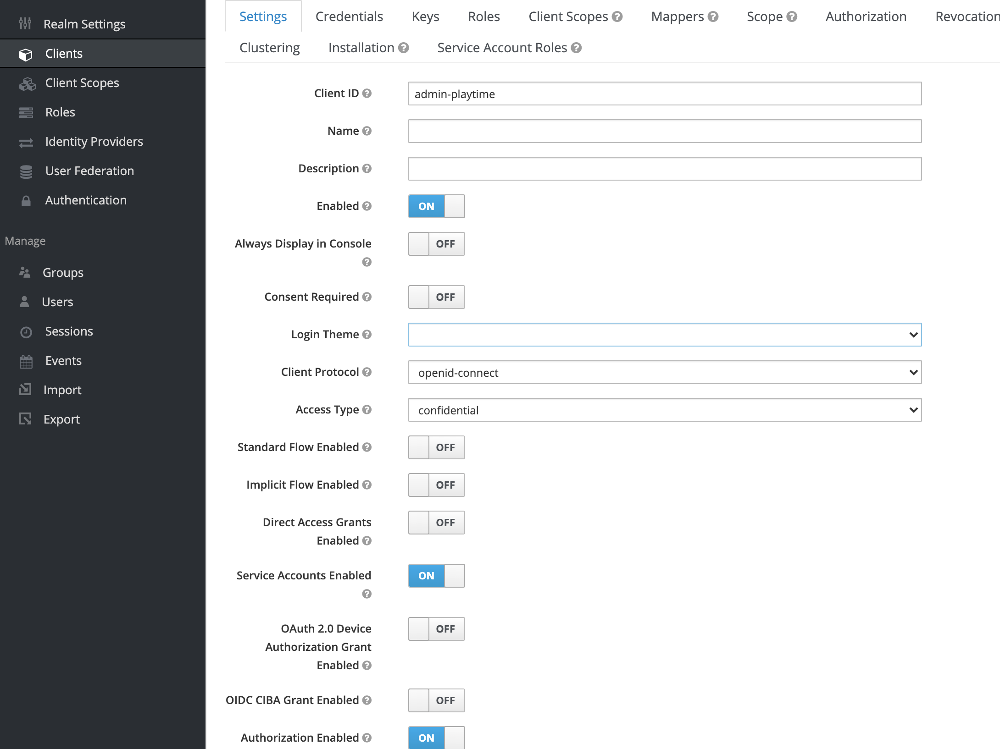
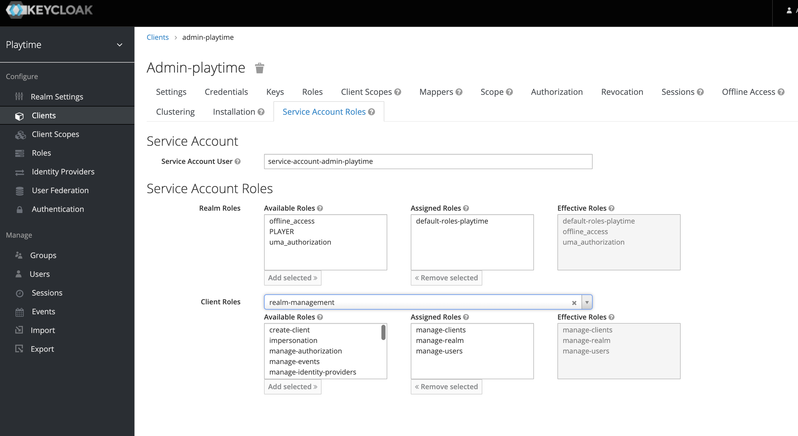

# PlayTime

PlayTime ist eine Community Platform für Pen&Paper, Tabletop und Boardgames Spieler. Die Spieler haben über PlayTime die
Möglichkeit sich zu Spielgruppen zu finden und Spielesessions zu planen.

## Architektur

1. [Einführung und Ziele](doku/1_Einfuehrung_Ziele.md)
2. [Randbedingung](doku/2_Randbedingung.md)
3. [Kontextabgrenzung](doku/3_Kontextabgrenzung.md)
4. [Lösungsstrategie](doku/4_Loesungsstrategie.md)
5. [Bausteinsicht](doku/5_Bausteinsicht.md)
6. [Laufzeitsicht](doku/6_Laufzeitsicht.md)
7. [Verteilungssicht](doku/7_Verteilungssicht.md)
8. [Querschnittliche Konzepte](doku/8_Querschnittliche_Konzepte.md)
9. [Entwurfsentscheidungen](doku/9_Entwurfsentscheidungen.md)
10. [Qualitätsanforderung](doku/10_Qualitaetsanforderung.md)
11. [Risiken und technische Schulden](doku/11_Risiken_technische_Schulden.md)
12. [Glossar](doku/12_Glossar.md)

## DevSetup

1. Docker starten `$ docker compose up -d`
2. Realm und Admin Client im [Keycloak](http://localhost:8081/auth/admin/master/console) einrichten
    1. Account Settings für den Admin Account
       
       
    2. Zudem muss noch die Rolle PLAYER eingerichtet werden

### Anforderungen

- Docker
- JDK