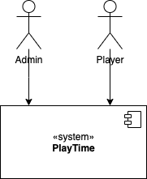

# 3. Kontextabgrenzung

## 3.1 Fachlicher Kontext

### Admin
Der Admin kann Spieler freischalten und aus dem System entfernen

### Spieler
Benutzten das System um Spieleabende zu organisieren.

### Goggle
Spieler können sich via Google ein Account bei PlayTime anlegen.