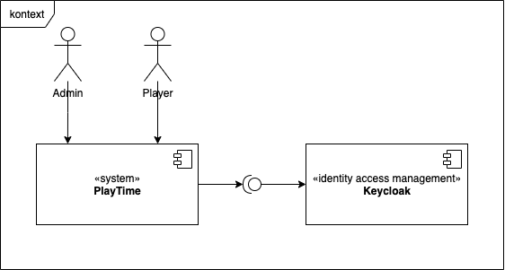

# 3. Kontextabgrenzung

Dieser Abschnitt beschreibt das Umfeld von PlayTime. Für welche Benutzer ist es da, und mit welchen Fremdsystemen interagiert es?

## 3.1 Fachlicher Kontext

### Admin

Der Admin kann Spieler freischalten und aus dem System entfernen

### Spieler

Benutzten das System um Spieleabende zu organisieren.

### Keycloak

Die Zugangsdaten sowie die Rollen und Rechte der Spieler werden in Keycloak verwaltet. Dabei wird Keycloak über eine API integriert.