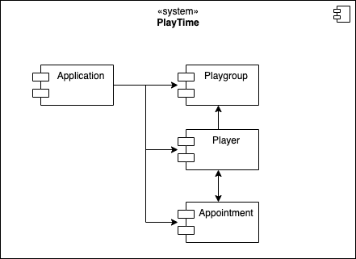

# 5. Bausteinsicht
Dieser Abschnitt beschreibt die Zerlegung von PlayTime in Module, wie sie sich auch in der Paketstruktur des Java-Quelltextes widerspiegelt.

| Module         | Kurzbeschreibung                                      |
|----------------|-------------------------------------------------------|
| Application    | Spring Boob infrastructure                            |
| Player         | beinhaltet sämtliche Logik für die Spieler            |
| Playgroup      | beinhaltet sämtliche Logik für die Spielgruppen       | 
| Appointment    | beinhaltet sämtliche Logik für die Spieleabende       | 
| User           | beinhaltet sämtliche Logik für die Benutzer           |
| Infrastructure | beinhaltet Datenbank und Keycloak einbindung          |
| SharedKernel   | beinhaltet Typ ValueObjects für die einzelnen Domänen |
