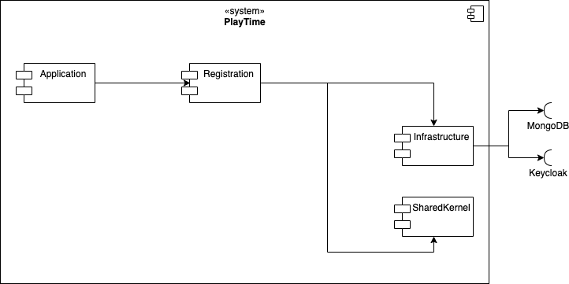

# 5. Bausteinsicht

Dieser Abschnitt beschreibt die Zerlegung von PlayTime in Module, wie sie sich auch in der Paketstruktur des
Java-Quelltextes widerspiegelt.

| Module         | Kurzbeschreibung                                                           |
|----------------|----------------------------------------------------------------------------|
| Application    | Spring Boob infrastructure                                                 |
| Registration   | beinhaltet sämtliche Logik zum registrieren eines User und der aktivierung |
| Infrastructure | beinhaltet Datenbank und Keycloak einbindung                               |
| SharedKernel   | beinhaltet Typ ValueObjects für die einzelnen Domänen                      |
