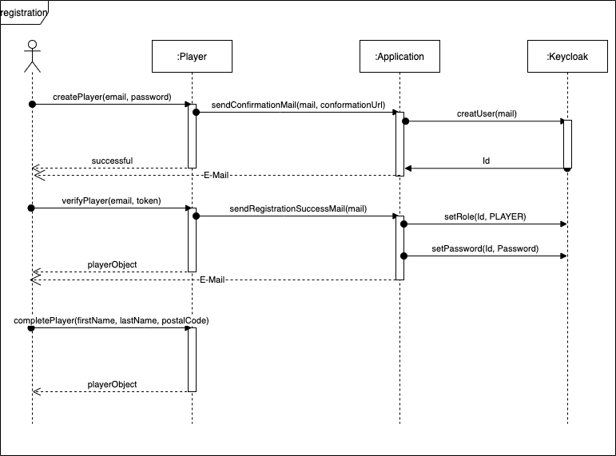

# 6. Laufzeitsicht

Diese Sicht visualisiert im Gegensatz zur statischen Bausteinsicht dynamische Aspekte. Wie spielen die Teile zusammen?

## 6.1 Registrierung

Der Benutzer erstellt sich einen neuen Spieler, bestätigt seine E-Mail-Adresse und vervollständigt seine Daten. Ein User
wird im Keycloak angelegt.

## 6.2 Spielgruppe verwalten

Benutzer können Spielgruppen erstellen und andere Spieler zu den Gruppen einladen.

## 6.3 Verfügbarkeitszeiten verwalten

Jeder Spiele kann Zeiten, wann er für eine Spielsitzung verfügbar ist angeben.

## 6.4 Spielsitzung verwalten

Spieler können für einzelne Spieler oder alle Spieler einer Spielgruppe eine Spielsitzung planen.